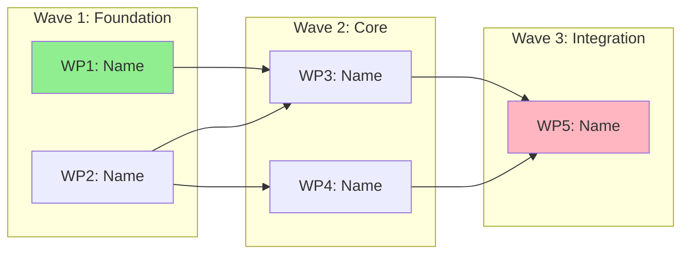
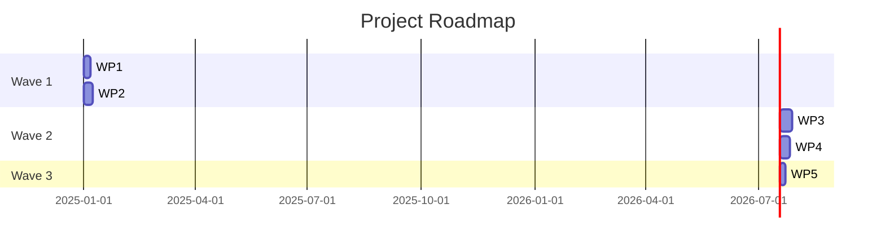
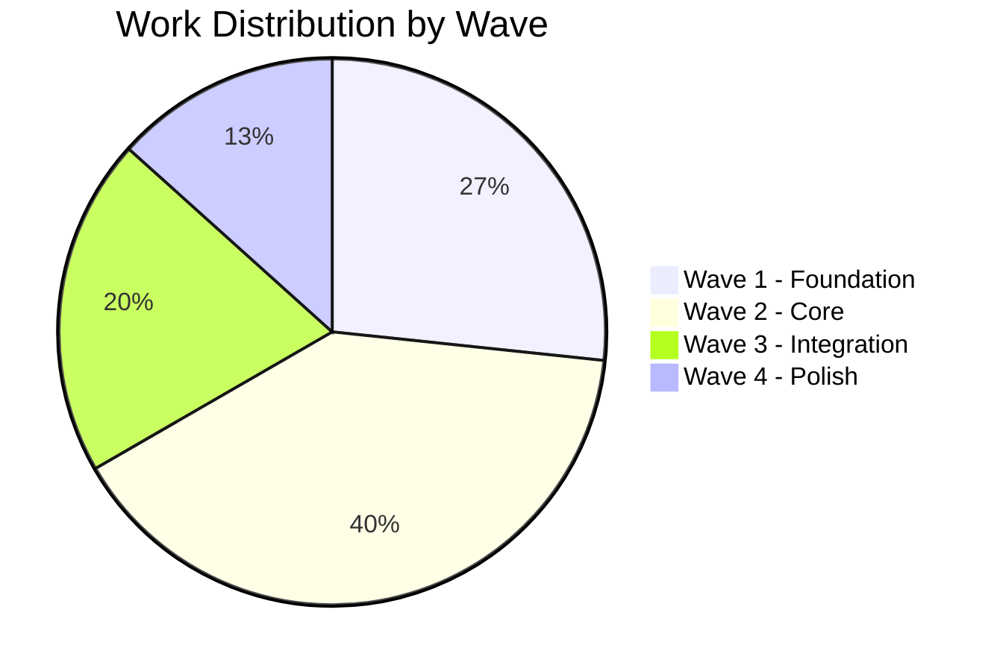

# Protocol: >>roadmap

**Trigger**: `>>roadmap` or "create a roadmap", "show dependencies"
**Purpose**: Generate roadmap with dependencies and visualization

---

## Protocol Steps

### 1. Analyze Dependencies

From `04-WORKPLAN.md`:
- Map all task/work package dependencies
- Identify critical path
- Find parallel opportunities
- Note bottlenecks

### 2. Generate 05-ROADMAP.md

```markdown
# Roadmap: [Name]

**Created**: [Date]
**Source Work Plan**: 04-WORKPLAN.md

## Dependency Analysis

### Critical Path
[Description of longest dependency chain]

Items on critical path:
1. [Item 1] → [Item 2] → [Item 3] → ...

### Parallel Opportunities
- [Items that can run in parallel]
- [More parallel work]

### Bottlenecks
| Bottleneck | Blocked Items | Mitigation |
|------------|---------------|------------|
| [Item] | [What it blocks] | [How to address] |

## Sequence Waves

### Wave 1: Foundation
**Can start immediately** - no dependencies

| Item | Type | Effort |
|------|------|--------|
| [WP/Task] | [Type] | [Estimate] |

### Wave 2: Core
**Requires**: Wave 1 complete

| Item | Type | Depends On | Effort |
|------|------|------------|--------|
| [WP/Task] | [Type] | [Dependency] | [Est] |

### Wave 3: Integration
**Requires**: Wave 2 complete

| Item | Type | Depends On | Effort |
|------|------|------------|--------|
| [WP/Task] | [Type] | [Dependency] | [Est] |

### Wave 4: Polish
**Requires**: Wave 3 complete

| Item | Type | Depends On | Effort |
|------|------|------------|--------|
| [WP/Task] | [Type] | [Dependency] | [Est] |

## Milestones

| Milestone | Wave | Key Deliverables |
|-----------|------|------------------|
| M1: [Name] | After Wave 1 | [What's delivered] |
| M2: [Name] | After Wave 2 | [What's delivered] |

## Risk Points

| Risk Point | Wave | Items Affected | Contingency |
|------------|------|----------------|-------------|
| [Risk] | [Wave] | [Items] | [Plan B] |
```

### 3. Generate 05-ROADMAP.mermaid.md

```markdown
# Roadmap Visualizations

## Dependency Graph



## Timeline View (if dates available)



## Status Overview



## Critical Path Highlight


```

### 4. Update OVERVIEW

Update `00-OVERVIEW.md`:
- Status to "Roadmapping" or "Ready for Review"
- Add roadmap summary

### 5. Present to Human

```
Roadmap generated.

Dependency Analysis:
- Critical Path: [Brief description]
- Parallel Opportunities: [Brief description]

Waves:
- Wave 1 (Foundation): [N] work packages - can start immediately
- Wave 2 (Core): [N] work packages - after Wave 1
- Wave 3 (Integration): [N] work packages - after Wave 2
...

Milestones: [N] defined

Created:
- 05-ROADMAP.md
- 05-ROADMAP.mermaid.md (visual diagrams)

Ready for >>finalize when roadmap is approved, or >>refine [phase] for changes.
```

---

## Related Protocols

- Creating work plan → [plan.md](plan.md)
- Refinement → [refine.md](refine.md)
- Finalizing → [finalize.md](finalize.md)
