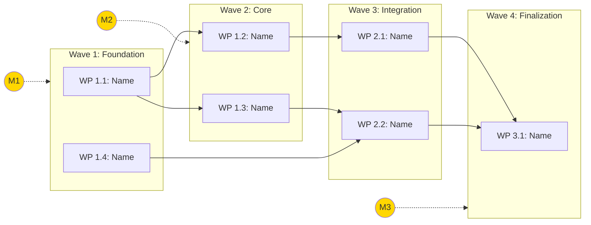
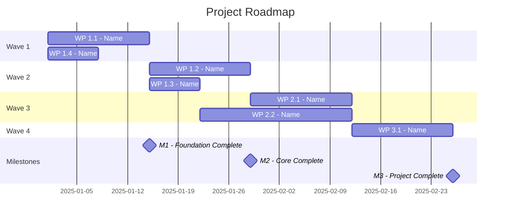
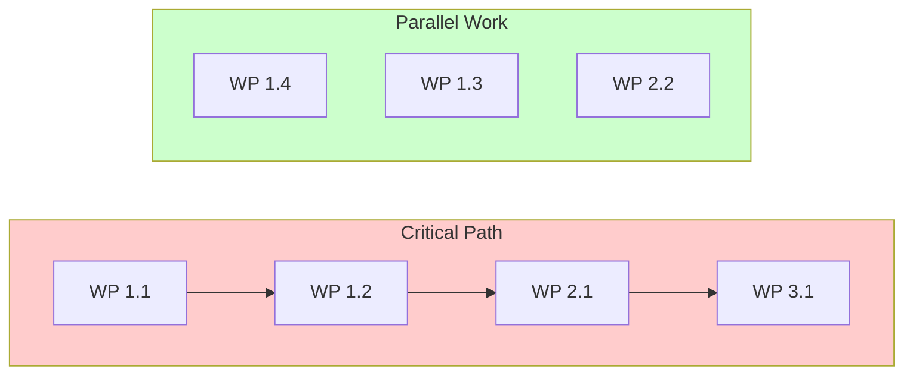
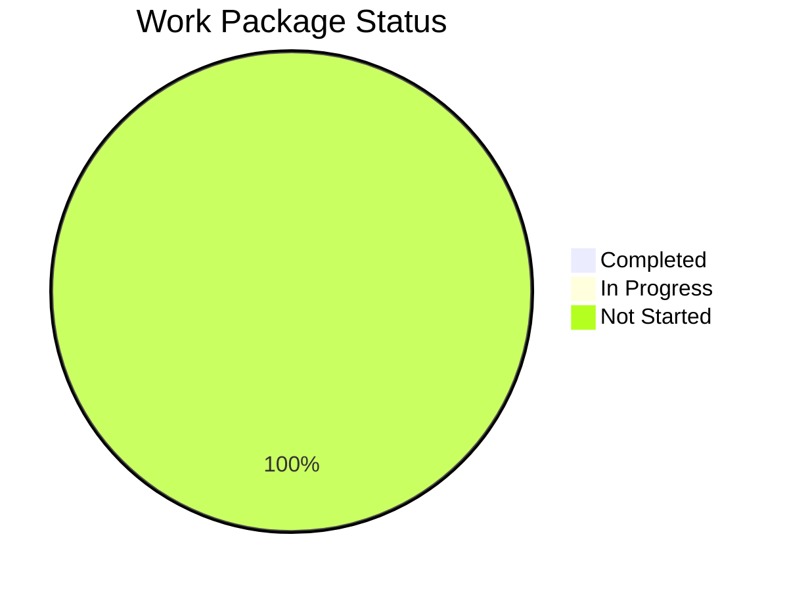

# Roadmap Visualization: [Concept Name]

> **Note**: This file is auto-generated from [05-ROADMAP.md](05-ROADMAP.md).
> Edit the source roadmap document for changes.

**Last Generated**: [YYYY-MM-DD]

---

## Dependency Graph

---

## Timeline View (if dates available)

---

## Critical Path Highlight

---

## Status Overview (update during execution)

---

## Notes

- Solid arrows (→) indicate hard dependencies
- Dashed arrows (-.→) indicate milestone checkpoints
- Update this file when roadmap changes using `>>roadmap`

---
**Auto-generated**: Do not edit directly
